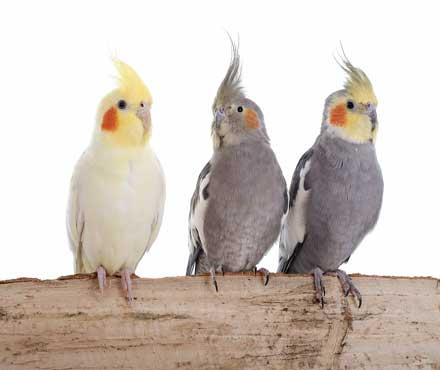

<!DOCTYPE html>
<html lang= "en">
  <header>
    <meta charset="utf-8">
    <title>Home</title>
  </header>
  <body>

 

<h1>Cockatiels</h1> 

<main>

 The <strong>cockatiel</strong> <em>(Nymphicus hollandicus)</em>, also known as <strong>miniature cockatoo, 

weero</strong>, or <strong>quarrion</strong>, is a bird that is a member of its own branch of the cockatoo 

family endemic to Australia. They are prized as household pets and companion parrots throughout the world and 

are relatively easy to breed. As a caged bird, cockatiels are second in popularity only to the budgerigar.

The cockatiel is the only member of the genus Nymphicus. It was previously considered a crested parrot or 

small cockatoo; however, more recent molecular studies have assigned it to its own subfamily, Nymphicinae. It 

is, therefore, now classified as the smallest of the Cacatuidae (cockatoo family). Cockatiels are native to 

Australia, favouring the Australian wetlands, scrublands, and bushlands.

<h3>Description</h3>

The cockatiel's distinctive erectile crest expresses the animal's emotional state. The crest 

is dramatically vertical when the cockatiel is startled or excited, gently oblique in its neutral or relaxed 

state, and flattened close to the head when the animal is angry or defensive. The crest is also held flat but 

protrudes outward in the back when the cockatiel is trying to appear alluring or flirtatious. In contrast to 

most cockatoos, the cockatiel has long tail feathers roughly making up half of its total length. At 30 to 33 cm 

(12 to 13 in), the cockatiel is the smallest of the cockatoos which are generally larger at between 30 and 60 

cm (12 and 24 in).

The "normal grey" or "wild-type" cockatiel's plumage is primarily grey with prominent white flashes on the 

outer edges of each wing. The face of the male is yellow or white, while the face of the female is primarily 

grey or light grey, and both sexes feature a round orange area on both ears, often referred to as "cheddar 

cheeks". This orange colouration is generally vibrant in adult males, and often quite muted in females. Visual 

sexing is often possible with this variant of the bird.

Cockatiels are relatively vocal birds, the calls of the male being more varied than that of the female. 

Cockatiels can be taught to sing specific melodies and speak many words and phrases.

</main>

<h2>More Information</h2>

<ul>
<li><a href="Taxonomy.html">Taxonomy and etymology</a></li>
<li><a href="Sexual.html">Sexual dimorphism</a></li>
<li><a href="Colour.html">Colour mutaions</a></li>
<li><a href="Distribution.html">Distributon and habitat</a></li>
</ul>

<table border= "4" align= "left" width="80%">
<caption><h3>Scientific classification</h3></caption>
<tr>
<th>Kingdom</th> 
<th>Phylum</th> 
<th>Class</th> 
<th>Order</th> 
<th>Family</th> 
<th>Subfamily</th> 
<th>Genus</th> 
<th>Species</th> 
</tr>
<tr>
<td>Animalia</td>
<td>Chordata</td>
<td>Aves</td>
<td>Psittaciformes</td>
<td>Cacatuidae</td>
<td>Nymphicinae</td>
<td>Nymphicus Wagler, 1832</td>
<td>N. hollandicus</td>
</tr>
<tr>
<th>Binomial name</th>
<td>Nymphicus hollandicus
(Kerr, 1792)</td>
</tr>

  </body>
</html>
